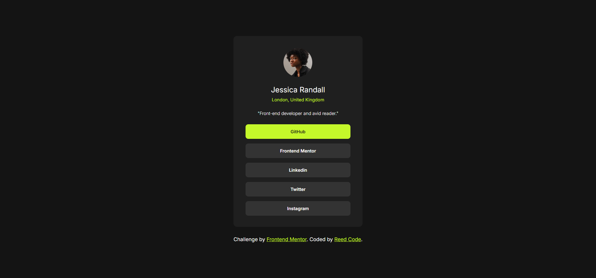

# Frontend Mentor - Social links profile solution

This is a solution to the [Social links profile challenge on Frontend Mentor](https://www.frontendmentor.io/challenges/social-links-profile-UG32l9m6dQ). Frontend Mentor challenges help you improve your coding skills by building realistic projects. 

## Table of contents

  - [The challenge](#the-challenge)
  - [Screenshot](#screenshot)
  - [Links](#links)
- [My process](#my-process)
  - [Built with](#built-with)
  - [What I learned](#what-i-learned)
- [Author](#author)

### The challenge

Users should be able to:

- See hover and focus states for all interactive elements on the page

### Screenshot

### Links

- Solution URL: [Add solution URL here](https://github.com/hsfarid/Social-links-preview)
- Live Site URL: [Add live site URL here](https://hsfarid.github.io/Social-links-preview/)

## My process
- I first sketched the layout of the design on a paper
- Then I wrote the html codes indicating all the sections of the design
- Use CSS to arrange and style all the sections

### Built with

- Semantic HTML5 markup
- CSS custom properties
- Flexbox
- CSS variables

### What I learned
I learned and used CSS variables to make my work cleaner, easier to read, and resuable.

## Author
- Frontend Mentor - [@hsfarid](https://www.frontendmentor.io/profile/hsfarid)
- Twitter - [@reed_code](https://www.twitter.com/reed_code)
